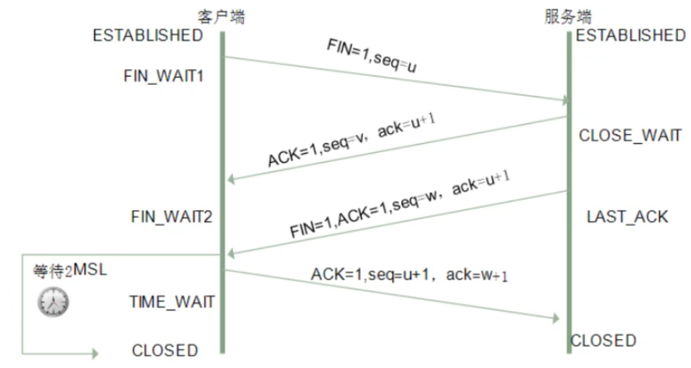

# 3 Http相关
## 3.1 说一说GET和POST请求的理解
- 相同点
  - Get和Post都是请求方式的一种，都可以实现客户端与服务端的通信，本质上都是TCP链接
- 不同点
  - 请求参数位置不同，Get是以?拼接在url的后面，而Post请求则是放在Request Body当中
  - 请求参数的大小限制不同，Get有参数的大小限制，而Post没有限制，Get请求的参数的大小限制不是服务器限制的，而是浏览器对url的长度有限制
  - 是否可以被收藏不同，Get请求可以作为一个页签的形式被收藏起来，Post请求不能
  - 缓存机制不同，浏览器会对Get请求进行缓存，但是不会对Post请求缓存，一般我们可以通过在Get请求的后面，拼接一个时间戳来避免进行缓存

注：TCP/IP，传输控制协议/网际协议，是指能够在多个不同网络间实现信息传输的协议

## 3.2 DNS协议是什么？说说DNS 完整的查询过程?
DNS协议指的是域名系统，DNS会进行域名和ip地址的转换，它相当于一个翻译官，会根据提供的域名，来返回对应的ip地址

查询过程：
- 查询浏览器缓存当中的域名和ip对照表
- 查询操作系统的DNS缓存
- 查询本地DNS服务器的缓存
- 查询上级域名服务器

## 3.3 如何理解CDN？说说实现原理？
CDN即内容分发网络，通俗来说就是根据用户的位置来分配最近的资源；有了CDN之后，当用户在访问一个资源的时候，可以无需访问源头的网站，而是访问距离客户最近的一个CDN节点，也称之为边缘节点。

当没有CDN的时候，我们访问一个网站，会进行DNS域名解析，找到域名所对应的ip地址，然后再向这个ip地址进行请求，这样的话，所有的请求都会到这一个ip地址上，无法做到负载均衡。

当有了CDN之后，我们访问一个网站，依然是会进行DNS域名解析，但是此时返回的并不是一个ip地址，而是一个别名记录，指向到了CDN的负载均衡系统，而CDN的负载均衡系统则会根据用户的位置、节点的状态来为用户分配节点，然后返回给用户，用户就会访问这个节点，这样也就实现了CDN加速和负载均衡

## 3.4 说说HTTP 常见的状态码有哪些，适用场景？
Http当中的状态码大致可以分为五类：
1. 1XX 消息
2. 2xx 请求成功
3. 3xx 资源重定向
4. 4xx 请求错误
5. 5xx 服务器内部错误

常用的状态码：
- 200 请求成功
- 301 永久重定向
- 302 临时重定向
- 401 未授权
- 403 禁止访问
- 404 资源不存在
- 408 请求超时
- 500 服务器内部错误

## 3.5 说说地址栏输入 URL 敲下回车后发生了什么？
1. 浏览器对URL进行解析
2. 对域名进行DNS查询
3. TCP链接
4. HTTP请求
5. 响应请求
6. 页面渲染

## 3.6 说说TCP为什么需要三次握手和四次挥手？
三次握手指的是在创建一个TCP链接的时候，客户端和服务端一共会发送三个包，主要的目的是为了确认双方的发送和接收能力是否正常，并且指定自己的初始化序列号为后面的传送做准备

三次握手的流程：
1. 第一次握手：客户端将自己的序列号发送给服务端
2. 第二次握手：服务端将自身的序列号，以及加1之后的客户端序列号，返回给客户端
3. 第三次握手：客户端将服务端的序列号加1之后，发送给客户端

至此，三次握手完毕，客户端和服务端确认了双方的发送和接收能力是正常的，此时客户端和服务端之间已经建立了链接

  

四次挥手指的是要终止一个TCP链接，需要经过四次发包

四次挥手的流程：
1. 第一次挥手：客户端发送序列号到服务端，通知服务端断开链接
2. 第二次挥手：服务端接到客户端的序列号之后，把客户端的序列号加1返回到客户端，表明服务端已经接收到了客户端断开链接的请求了
3. 第三次挥手：服务端将自身的序列号发送给客户端，进行链接的关闭
4. 第四次挥手：客户端接到报文后，将服务端的序列号加1，传递给服务端，服务端接收到报文之后，就处于了关闭状态

至此，TCP成功断开链接

四次挥手的原因：
服务端在收到客户端断开链接的报文之后，并不会立即关闭链接，而是先发送一个包给客户端，告诉客户端，服务端已经收到了关闭链接的请求，只有当服务器的所有报文发送完毕之后，才会进行断开链接的操作，因为需要四次挥手

  

## 3.7 什么是HTTP? HTTP 和 HTTPS 的区别?
HTTP是超文本运输协议，是实现网络通信的一种规范；HTTP支持传送任何类型的数据对象，通过Content-Type来进行标记，HTTP是使用明文来进行传输的，没有提供任何的加密方式。

在进行HTTP请求的时候，请求是可以被抓包和监听的，那明文传输的内容就会被获取到，安全性得不到保障，HTTPS的出现就是为了解决这种状况的，HTTPS在传输内容时会进行内容的加密，安全性比HTTP好，HTTPS的加密是基于SSL/TLS协议，相当于在通信的中间，多增加了一个校验的环节。

## 3.8 为什么说HTTPS比HTTP安全? HTTPS是如何保证安全的？
HTTPS与HTTP相比，使用了SSL加密，传输的内容不再是明文形式，相对来说安全很多